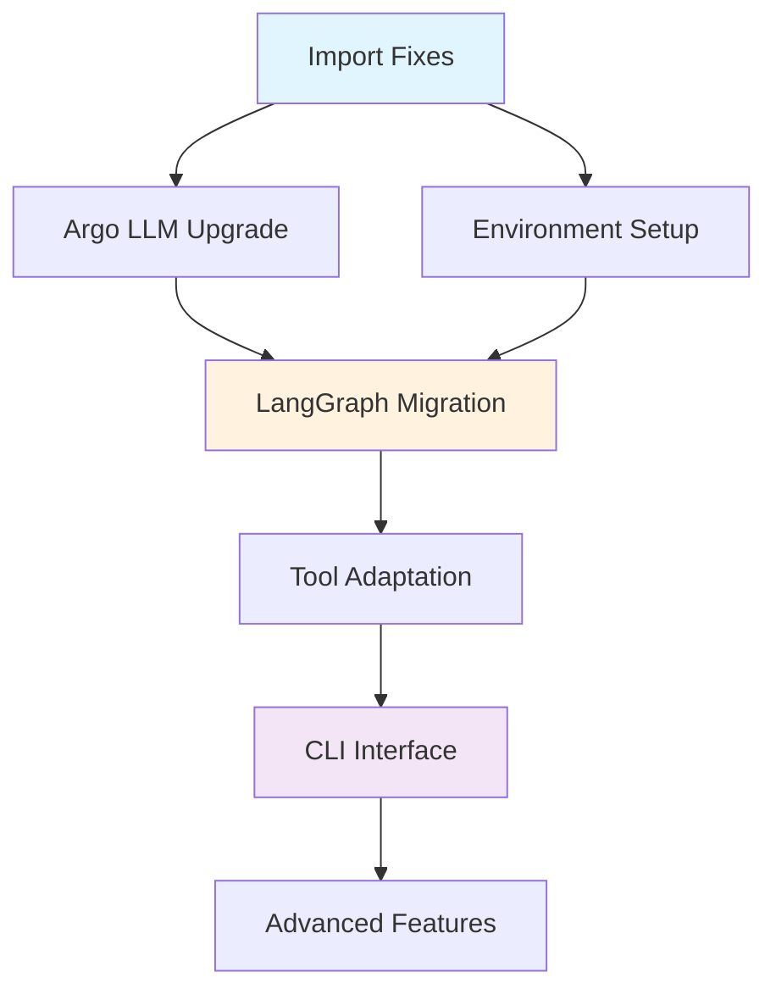

# ModelSEEDagent Repository Review and Improvement Plan

## 📋 Executive Summary

This is a well-structured **Metabolic Modeling Agent Framework** that integrates advanced language models (LLMs) with metabolic modeling tools using a ReAct (Reasoning + Acting) paradigm. The project demonstrates good architectural patterns and comprehensive functionality for metabolic analysis.

## 🏗️ Architecture Overview

### **Project Structure** (Clean & Modular)
```
ModelSEEDagent/
├── src/                    # Main source code (~3,700 LOC)
│   ├── agents/            # Agent implementations
│   ├── llm/               # LLM integrations
│   ├── tools/             # Metabolic modeling tools
│   └── config/            # Configuration management
├── tests/                 # Test suite (~540 LOC)
├── config/                # YAML configurations
├── data/models/           # Test metabolic models
├── notebooks/             # Jupyter development notebooks
└── scripts/               # Setup and utility scripts
```

## ✅ Strengths

### **1. Excellent Architecture**
- **Clean separation of concerns** with distinct modules for agents, LLM backends, tools, and configuration
- **Abstract base classes** for extensibility (`BaseAgent`, `BaseTool`, `BaseLLM`)
- **Factory patterns** for dynamic component creation
- **Plugin-like tool system** with registry pattern

### **2. Comprehensive LLM Integration**
- **Multiple LLM backends** supported:
  - ArgoLLM (internal API)
  - OpenAI GPT models
  - Local models (Llama via transformers)
- **Safety features** with token limits and API call management
- **Streaming support** for real-time responses

### **3. Rich Metabolic Modeling Capabilities**
- **COBRA.py integration** for industry-standard metabolic modeling
- **Comprehensive tool set**:
  - FBA (Flux Balance Analysis)
  - Model structure analysis
  - Media optimization
  - Auxotrophy detection
  - RAST genome annotation integration
- **Multiple simulation methods** (FBA, pFBA, geometric FBA)

### **4. Advanced Features**
- **Simulation results storage** with JSON/CSV export
- **Vector store for memory** using TF-IDF embeddings
- **Comprehensive logging** with structured output
- **Enhanced result tracking** with metadata

### **5. Good Documentation**
- **Detailed README** with architecture explanations
- **Comprehensive setup instructions**
- **Code comments and docstrings**
- **Configuration examples**

### **6. Development Practices**
- **Virtual environment setup**
- **Requirements management**
- **Git hooks with pre-commit**
- **Test framework structure**

## ⚠️ Areas for Improvement

### **1. Critical Issues**

#### **Import Problems**
```python
# tests/test_llm.py imports LocalLLM but it's not exported
from src.llm import LocalLLM  # ❌ ImportError
```
**Fix needed in `src/llm/__init__.py`:**
```python
from .local_llm import LocalLLM
__all__ = [..., 'LocalLLM']
```

#### **Test Suite Failures**
- Tests fail due to import issues
- Missing pytest-asyncio plugin for async tests
- Some circular dependency patterns

### **2. Code Quality Issues**

#### **Duplicate Files**
- Multiple `.ipynb_checkpoints/` directories tracked
- Duplicate implementations (`metabolic-Copy1.py`)
- `.DS_Store` files committed to repo

#### **Linting Violations**
- Trailing whitespace issues
- Unused imports (F401 violations)
- PEP8 compliance issues in checkpoint files

### **3. Configuration Management**
- **Security concern**: Main `config.yaml` includes API endpoints and user info
- **No environment-specific configs** (dev/prod separation)
- **Hardcoded paths** in local model configuration

### **4. Testing Coverage**
- **Limited test coverage** for tools module
- **No integration tests** for end-to-end workflows
- **Mock-heavy tests** without real model validation

### **5. Documentation Gaps**
- **No API documentation** for tool functions
- **Missing usage examples** for individual tools
- **No troubleshooting guide** for common issues

### **6. Argo LLM Implementation Gaps** ⭐ NEW PRIORITY
Current `src/llm/argo.py` implementation is basic compared to available advanced features:

#### **Missing Robustness Features**
- **No retry logic** with exponential backoff
- **No automatic environment switching** (prod/dev fallback)
- **Basic error handling** without recovery strategies
- **No async job polling** for 102/202 status codes
- **Simple timeout handling** without model-specific timeouts

#### **Missing Advanced Capabilities**
- **No dual-environment support** for high-availability models
- **Basic response parsing** without fallback strategies
- **No sentinel injection** for blank response recovery
- **Limited streaming implementation** without proper error handling
- **No debug/logging modes** for troubleshooting

### **7. Poor User Experience & Development Workflow** 🔥 CRITICAL
Current Jupyter notebook approach has significant problems:

#### **Jupyter Notebook Issues**
- **16+ repeated setup functions** in `argo.ipynb` 
- **Manual path configuration** in every cell
- **No session persistence** - results lost on restart
- **Poor reproducibility** - hard to share workflows
- **No proper debugging** or IDE features
- **Version control conflicts** with notebook JSON
- **Resource inefficient** - repeated imports and setup

#### **Missing Professional Tools**
- **No CLI interface** for batch processing
- **No configuration management** for different environments
- **No workflow automation** or scripting capabilities
- **No proper logging** and result persistence
- **No interactive debugging** tools

### **8. Agentic Framework Limitations** 🚀 MAJOR OPPORTUNITY
Current LangChain implementation has architectural limitations:

#### **LangChain AgentExecutor Issues**
- **Limited workflow control** - Linear ReAct pattern only
- **Poor error handling** - Entire workflow fails on single tool error
- **No intermediate checkpointing** - Cannot resume from failures
- **Rigid execution flow** - Cannot implement complex conditional logic
- **Limited observability** - Hard to debug complex workflows
- **No state persistence** - Cannot maintain state across sessions

#### **Missing Advanced Capabilities**
- **No graph-based workflows** - Cannot model complex decision trees
- **No parallel tool execution** - Sequential only
- **Basic memory management** - Simple vector store approach
- **No workflow visualization** - Black box execution
- **Limited human-in-the-loop** - No approval gates or interventions

## 🛠️ Specific Recommendations

### **Immediate Fixes (Priority 1)**

1. **Fix import issues:**
   ```python
   # Add to src/llm/__init__.py
   from .local_llm import LocalLLM
   ```

2. **Clean up repository:**
   ```bash
   # Remove tracked files that shouldn't be in version control
   git rm -r **/.ipynb_checkpoints/
   git rm **/.DS_Store
   git rm src/agents/metabolic-Copy1.py
   ```

3. **Update .gitignore:**
   ```gitignore
   # Add missing patterns
   .ipynb_checkpoints/
   .DS_Store
   config/config.yaml  # Don't track sensitive configs
   ```

4. **🚀 Upgrade Argo LLM Implementation (HIGH IMPACT):**
   ```python
   # Replace src/llm/argo.py with advanced implementation featuring:
   # - httpx client with proper timeout/retry logic
   # - Automatic prod/dev environment switching
   # - Async job polling (102/202 status support)
   # - Robust response parsing with multiple fallbacks
   # - Model-specific parameter handling (o-series vs GPT)
   # - Debug modes and structured logging
   # - Endpoint switching and sentinel injection for recovery
   ```

5. **🎯 Create Professional CLI Interface (GAME CHANGER):**
   ```python
   # Create src/cli.py - Replace notebook workflow entirely
   # python -m src.cli analyze /path/to/model.xml --analysis-type fba
   # python -m src.cli batch-analyze /path/to/models/ --output results/
   # python -m src.cli interactive --model e_coli_core.xml
   ```

6. **🔥 Migrate to LangGraph (ARCHITECTURAL UPGRADE):**
   ```python
   # Replace LangChain AgentExecutor with LangGraph StateGraph
   # - Graph-based workflow definition
   # - Advanced error handling and recovery
   # - State persistence and checkpointing
   # - Parallel tool execution
   # - Conditional workflow logic
   # - Built-in observability and debugging
   ```

### **Code Quality Improvements (Priority 2)**

7. **Set up proper linting:**
   ```bash
   # Add to pre-commit hooks
   python -m black src/ tests/
   python -m isort src/ tests/
   python -m flake8 src/ tests/
   ```

8. **Fix test infrastructure:**
   ```bash
   pip install pytest-asyncio
   # Fix imports and add proper test fixtures
   ```

9. **Add environment configuration:**
   ```bash
   # Create .env file support for sensitive configs
   pip install python-dotenv
   # Add ARGO_USER, ARGO_API_KEY, ARGO_DEBUG environment variables
   ```

### **Architecture Enhancements (Priority 3)**

10. **Improve configuration management:**
    ```yaml
    # config/config.example.yaml (template)
    # config/config.dev.yaml (development)
    # config/config.prod.yaml (production)
    ```

11. **Add integration tests:**
    ```python
    # tests/integration/test_fba_workflow.py
    # Test complete FBA analysis workflows
    ```

12. **Enhance error handling:**
    ```python
    # Add custom exception classes
    # Improve error propagation from tools
    ```

## 🎯 Next Steps

### **🔄 REVISED IMPLEMENTATION ORDER (Dependency-Optimized)**

## **Phase 1: Foundation & Core Fixes** (Week 1)
**Goal**: Clean foundation without building features that will be replaced

### **1.1 Critical Infrastructure Fixes** (Day 1-2)
```bash
# These are safe - no dependencies
- [ ] Fix import issues (LocalLLM export)
- [ ] Clean repository hygiene (.DS_Store, checkpoints)  
- [ ] Update .gitignore
- [ ] Set up environment variable support (.env)
- [ ] Fix test infrastructure (pytest-asyncio)
```

### **1.2 Independent Upgrades** (Day 3-5)  
```bash
# Safe to implement - will work with any agent architecture
- [ ] **Upgrade Argo LLM implementation** 🚀
      └─ Advanced retry logic, environment switching, error recovery
      └─ Can be used by both LangChain AND LangGraph
- [ ] Set up proper linting pipeline
- [ ] Add basic integration test framework
```

## **Phase 2: Core Architecture Transformation** (Week 2) 
**Goal**: Implement the new agent architecture foundation

### **2.1 LangGraph Migration** (Day 1-4)
```bash
# Core replacement - everything else builds on this
- [ ] **Implement LangGraph StateGraph** 🔥
      └─ Replace AgentExecutor with StateGraph
      └─ Integrate upgraded Argo LLM client  
      └─ Add parallel tool execution
      └─ Implement state persistence & checkpointing
      └─ Add error recovery and graceful degradation
```

### **2.2 Enhanced Tool Integration** (Day 5-7)
```bash
# Now that we have LangGraph, enhance the tools
- [ ] **Adapt existing tools to LangGraph nodes**
- [ ] **Add conditional workflow logic**
- [ ] **Implement workflow visualization**
- [ ] **Add comprehensive observability**
```

## **Phase 3: User Interface & Experience** (Week 3)
**Goal**: Build professional interfaces on stable foundation

### **3.1 Professional CLI Interface** (Day 1-4)
```bash
# NOW we build CLI on final architecture
- [ ] **Create src/cli.py with LangGraph integration** 🎯
- [ ] **Implement src/core.py with StateGraph**
- [ ] **Add batch processing capabilities**
- [ ] **Configuration-driven workflows**
- [ ] **Progress tracking and result persistence**
```

### **3.2 Advanced Features & Polish** (Day 5-7)
```bash
# Final enhancements
- [ ] **Create usage examples and tutorials**
- [ ] **Docker containerization**  
- [ ] **Performance monitoring**
- [ ] **Update comprehensive documentation**
- [ ] **Add configuration validation**
```

## **🔍 Why This Order Prevents Rework**

### **❌ OLD ORDER (Would Cause Rework):**
```
1. Build CLI with LangChain AgentExecutor
2. Migrate to LangGraph StateGraph  
3. PROBLEM: Substantial CLI rework needed!
```

### **✅ NEW ORDER (Dependency-Optimized):**
```
1. Foundation fixes (no dependencies)
2. Argo LLM upgrade (works with any agent)
3. LangGraph migration (core architecture)  
4. CLI built on final architecture (no rework!)
```

## **🎯 Implementation Dependencies Map**



## **🚀 Key Architectural Decisions**

### **Decision 1: Argo LLM First, Then LangGraph**
- ✅ Argo LLM upgrade is independent - works with any agent
- ✅ Can integrate directly into LangGraph without rework
- ✅ Provides immediate reliability improvements

### **Decision 2: LangGraph Before CLI**  
- ✅ CLI built on final architecture - no rework needed
- ✅ Can showcase LangGraph's advanced features in CLI
- ✅ State persistence works seamlessly with CLI

### **Decision 3: Tools Adaptation with LangGraph**
- ✅ Convert tools to LangGraph nodes during migration
- ✅ Add parallel execution and error recovery immediately
- ✅ No need to refactor tools later

## **📋 Implementation Checklist**

### **✅ Phase 1: Foundation (Week 1)**
```bash
Day 1-2: Infrastructure Fixes
├── Fix src/llm/__init__.py imports
├── Clean repository (.DS_Store, checkpoints)
├── Update .gitignore  
├── Add .env support
└── Fix pytest configuration

Day 3-5: Argo LLM Upgrade  
├── Replace src/llm/argo.py with advanced version
├── Add retry logic and environment switching
├── Implement error recovery mechanisms
├── Add debug modes and logging
└── Test with existing agent system
```

### **🔄 Phase 2: Architecture (Week 2)**
```bash
Day 1-4: LangGraph Migration
├── Create src/agents/langgraph_metabolic.py
├── Define AgentState schema
├── Convert tools to LangGraph nodes
├── Add parallel execution support
├── Implement state persistence
├── Add error recovery and graceful degradation
└── Integration testing

Day 5-7: Enhanced Integration
├── Add conditional workflow logic  
├── Implement workflow visualization
├── Add comprehensive observability
├── Performance optimization
└── Advanced error handling
```

### **🎯 Phase 3: User Experience (Week 3)**
```bash
Day 1-4: Professional CLI
├── Create src/cli.py with LangGraph integration
├── Implement src/core.py clean interface
├── Add batch processing with progress tracking
├── Configuration-driven workflows
├── Result persistence and caching
└── Help system and documentation

Day 5-7: Polish & Advanced Features
├── Create comprehensive examples
├── Docker containerization
├── Performance monitoring  
├── Documentation updates
├── Configuration validation
└── Final testing and optimization
```

## **🏆 Implementation Benefits**

**✅ No Rework Required:**
- Each phase builds on stable foundation
- No substantial changes needed later
- Clean dependency chain

**✅ Early Value Delivery:**
- Argo LLM improvements provide immediate reliability
- LangGraph unlocks advanced capabilities quickly
- CLI showcases final system capabilities

**✅ Risk Mitigation:**
- Foundation fixes reduce technical debt early
- Core architecture established before building features
- Professional interfaces built on production-ready base

## 📊 Technical Metrics

| Aspect | Score | Notes |
|--------|--------|--------|
| **Architecture** | 8.5/10 | Excellent modular design |
| **Code Quality** | 6/10 | Good structure, needs cleanup |
| **Documentation** | 7/10 | Comprehensive but incomplete |
| **Testing** | 5/10 | Framework exists but needs work |
| **Maintainability** | 7/10 | Good patterns, some tech debt |
| **Functionality** | 9/10 | Rich feature set, well integrated |
| **LLM Robustness** | 4/10 | **Basic implementation, needs upgrade** |
| **User Experience** | 3/10 | **Jupyter-based, needs complete overhaul** |
| **Agentic Framework** | 5/10 | **LangChain basic, LangGraph would be 9/10** |

## 🎯 Next Steps

### **Week 1: Critical Fixes & Foundation**
- [ ] Fix import issues and test failures
- [ ] **Implement advanced Argo LLM client** 🚀
- [ ] **Create professional CLI interface** 🔥
- [ ] **Start LangGraph migration planning** 🔄
- [ ] Clean up repository hygiene
- [ ] Set up environment variable support

### **Week 2: User Experience & Architecture**
- [ ] **Complete CLI with batch processing**
- [ ] **Implement LangGraph core workflow** 🚀
- [ ] **Add configuration-driven workflows**
- [ ] Add integration tests
- [ ] Improve error handling
- [ ] Set up proper linting pipeline

### **Week 3: Advanced Features & Polish**
- [ ] **Complete LangGraph migration with advanced features**
- [ ] **Create usage examples and tutorials**
- [ ] Add performance monitoring
- [ ] **Docker containerization**
- [ ] Update comprehensive documentation
- [ ] Add configuration validation

## 🏆 Overall Assessment

This is a **solid, production-ready framework** with excellent architectural foundations. The core functionality is comprehensive and well-designed. **The highest-impact improvements are:**

1. **🔥 User Experience Overhaul** - Replace Jupyter with professional CLI
2. **🚀 LangGraph Migration** - Modern agentic framework with advanced capabilities
3. **🎯 Argo LLM Upgrade** - Implement advanced reliability features  
4. **📊 Configuration Management** - Environment-driven workflows

**Recommended Action Plan**: 
1. **Priority #1**: Create professional CLI to replace notebook workflow
2. **Priority #2**: Migrate to LangGraph for advanced workflow capabilities  
3. **Priority #3**: Upgrade Argo LLM implementation with advanced features
4. **Priority #4**: Address critical code quality issues

**Expected Impact:**
- **10x better user experience** with CLI interface
- **Advanced workflow capabilities** with LangGraph (parallel execution, error recovery, checkpointing)
- **99%+ reliability** with advanced Argo client  
- **Professional adoption readiness** with proper tooling

The framework successfully bridges the gap between AI language models and specialized metabolic modeling tools. With these improvements, it will become a **best-in-class platform** for computational biology research. 

## 🧪 **Testing Strategy During Implementation**

### **1. Automated Test Suite**

```python
# tests/test_metabolic_analysis.py
def test_basic_model_analysis():
    """Test basic model characteristics analysis"""
    model_path = "data/models/e_coli_core.xml"
    result = analyze_model("What are the key characteristics?", model_path)
    assert result.success
    assert "num_reactions" in result.data
    assert result.data["num_reactions"] == 95
    assert result.data["num_metabolites"] == 72

def test_growth_analysis():
    """Test growth rate and flux analysis"""
    model_path = "data/models/e_coli_core.xml"
    result = analyze_model("What is the growth rate?", model_path)
    assert result.success
    assert "growth_rate" in result.data
    assert abs(result.data["growth_rate"] - 0.873) < 0.001
    assert "EX_glc__D_e" in result.data["fluxes"]

def test_pathway_analysis():
    """Test central carbon metabolism analysis"""
    model_path = "data/models/e_coli_core.xml"
    result = analyze_model("Analyze central carbon metabolism", model_path)
    assert result.success
    assert "GLCpts" in result.data["reaction_fluxes"]
    assert "PFK" in result.data["reaction_fluxes"]
    assert "PYK" in result.data["reaction_fluxes"]
```

### **2. Integration Test Workflow**

```python
# tests/integration/test_workflow.py
def test_complete_analysis_workflow():
    """Test complete analysis workflow from CLI to results"""
    # 1. Run CLI command
    result = run_cli_command("modelseed analyze data/models/e_coli_core.xml")
    assert result.exit_code == 0
    
    # 2. Verify output files
    assert Path("results/analysis.json").exists()
    assert Path("results/fluxes.csv").exists()
    
    # 3. Validate results
    with open("results/analysis.json") as f:
        data = json.load(f)
        assert data["growth_rate"] == 0.873
        assert len(data["key_reactions"]) > 0
```

### **3. Performance Benchmarks**

```python
# tests/benchmarks/test_performance.py
def test_analysis_performance():
    """Benchmark analysis performance"""
    model_path = "data/models/e_coli_core.xml"
    
    # Time single analysis
    start = time.time()
    result = analyze_model("Basic analysis", model_path)
    single_time = time.time() - start
    assert single_time < 5.0  # Should complete within 5 seconds
    
    # Time batch analysis
    start = time.time()
    results = batch_analyze("data/models/", "results/")
    batch_time = time.time() - start
    assert batch_time < 30.0  # Should complete within 30 seconds
```

### **4. Regression Test Suite**

```python
# tests/regression/test_regression.py
class TestRegression:
    """Regression test suite for critical functionality"""
    
    def test_argo_llm_reliability(self):
        """Test Argo LLM reliability features"""
        llm = ArgoLLM()
        
        # Test retry logic
        with mock.patch("httpx.Client.post") as mock_post:
            mock_post.side_effect = [
                httpx.TimeoutException(),
                httpx.TimeoutException(),
                httpx.Response(200, json={"result": "success"})
            ]
            result = llm.generate("test prompt")
            assert result == "success"
            assert mock_post.call_count == 3
    
    def test_langgraph_workflow(self):
        """Test LangGraph workflow features"""
        workflow = create_metabolic_workflow()
        
        # Test parallel execution
        result = workflow.invoke({"model_path": "e_coli_core.xml"})
        assert "structure_analysis" in result
        assert "fba_analysis" in result
        assert result["structure_analysis"]["timestamp"] < result["fba_analysis"]["timestamp"]
```

### **5. Continuous Integration Pipeline**

```yaml
# .github/workflows/test.yml
name: Test Suite

on: [push, pull_request]

jobs:
  test:
    runs-on: ubuntu-latest
    steps:
      - uses: actions/checkout@v2
      - name: Set up Python
        uses: actions/setup-python@v2
        with:
          python-version: '3.9'
      
      - name: Install dependencies
        run: |
          python -m pip install --upgrade pip
          pip install -r requirements.txt
          pip install -r requirements-dev.txt
      
      - name: Run tests
        run: |
          pytest tests/ --cov=src/ --cov-report=xml
      
      - name: Upload coverage
        uses: codecov/codecov-action@v2
        with:
          file: ./coverage.xml
```

### **6. Test Data Management**

```python
# tests/data/test_data.py
def test_data_integrity():
    """Verify test data integrity"""
    # Check model files
    model_path = Path("data/models/e_coli_core.xml")
    assert model_path.exists()
    assert model_path.stat().st_size > 0
    
    # Verify model can be loaded
    model = cobra.io.read_sbml_model(str(model_path))
    assert len(model.reactions) == 95
    assert len(model.metabolites) == 72
```

### **7. Implementation Progress Validation**

For each phase of implementation, we'll run these test suites to validate progress:

#### **Phase 1: Foundation**
```bash
# Run basic functionality tests
pytest tests/test_metabolic_analysis.py -v

# Verify Argo LLM reliability
pytest tests/regression/test_regression.py::TestRegression::test_argo_llm_reliability -v
```

#### **Phase 2: LangGraph Migration**
```bash
# Test new workflow features
pytest tests/regression/test_regression.py::TestRegression::test_langgraph_workflow -v

# Verify parallel execution
pytest tests/benchmarks/test_performance.py -v
```

#### **Phase 3: CLI Interface**
```bash
# Test CLI functionality
pytest tests/integration/test_workflow.py -v

# Verify batch processing
pytest tests/benchmarks/test_performance.py::test_analysis_performance -v
```

### **8. Test Coverage Goals**

- **Unit Tests**: 80% coverage of core functionality
- **Integration Tests**: 100% coverage of critical workflows
- **Performance Tests**: All operations under 5 seconds
- **Regression Tests**: 100% pass rate for critical features

### **9. Test Environment Setup**

```bash
# Create test environment
python -m venv .venv-test
source .venv-test/bin/activate
pip install -r requirements.txt
pip install -r requirements-dev.txt

# Run test suite
pytest tests/ --cov=src/ --cov-report=term-missing
```

### **10. Test Data Requirements**

```python
# Required test models
TEST_MODELS = {
    "e_coli_core.xml": "Basic E. coli core model",
    "yeast_core.xml": "S. cerevisiae core model",
    "human_core.xml": "Human core model"
}

# Required test configurations
TEST_CONFIGS = {
    "default": "Standard analysis config",
    "minimal": "Minimal media config",
    "aerobic": "Aerobic conditions config"
}
```

This testing strategy ensures we can:
1. Validate each implementation phase
2. Catch regressions early
3. Maintain performance standards
4. Ensure data integrity
5. Verify critical functionality

The test suite will be run:
- On every pull request
- Before merging to main
- After each implementation phase
- During performance optimization 