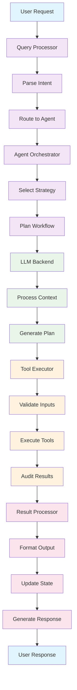
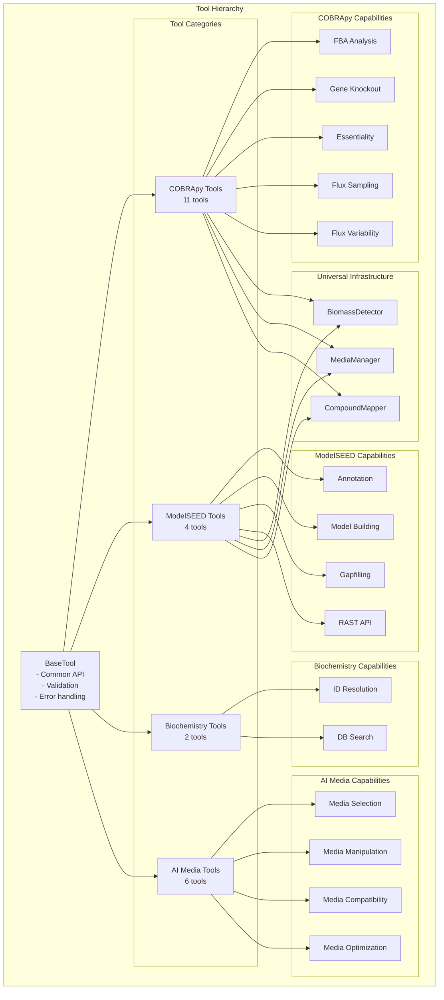
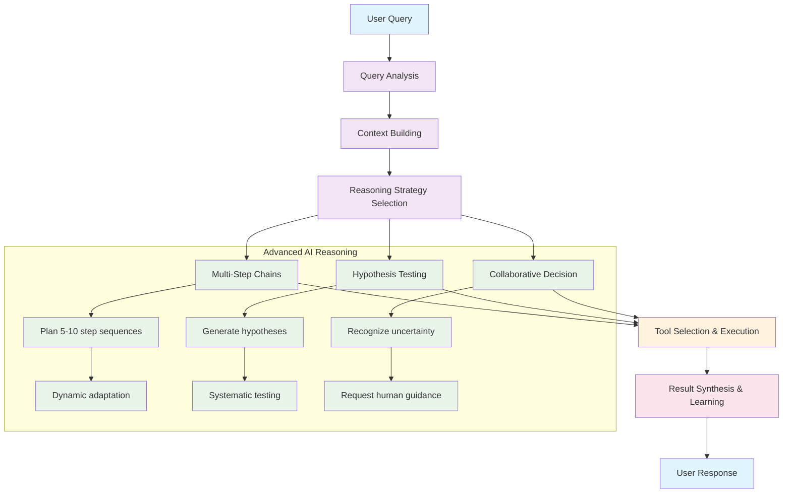

# ModelSEEDagent - System Architecture

## Overview

ModelSEEDagent is an AI-powered metabolic modeling platform that combines Large Language Models with specialized computational biology tools. The system uses an intelligent agent-based approach where AI components orchestrate workflows by selecting and chaining appropriate tools to solve complex metabolic modeling problems.

## Design Principles

- **AI-Driven Orchestration**: LLMs intelligently select tools and manage workflows
- **Modular Design**: Clean separation between reasoning, tool execution, and data layers
- **Universal Compatibility**: Seamless integration across ModelSEED and COBRApy ecosystems
- **Production Ready**: Comprehensive testing, audit trails, and performance optimization
- **Extensible Framework**: Easy addition of new tools, agents, and LLM backends

## System Architecture Diagram

### High-Level Component Overview

```mermaid
graph TB
    subgraph "User Interfaces"
        UI1[Interactive Chat Interface]
        UI2[CLI Commands]
        UI3[Python API]
        UI4[Web Interface<br/>(Future)]
    end

    subgraph "Agent Orchestration Layer"
        AG1[LangGraph Workflows]
        AG2[Metabolic Agent]
        AG3[Reasoning Chains]
        AG4[Collaborative Decision Making]
    end

    subgraph "LLM Abstraction Layer"
        LLM1[Argo Gateway<br/>13 models]
        LLM2[OpenAI API]
        LLM3[Local LLMs<br/>Llama 3.x]
        LLM4[Model Factory & Config]
    end

    subgraph "Tool Execution Layer"
        T1[COBRApy Tools<br/>16 tools]
        T2[ModelSEED Tools<br/>5 tools]
        T3[Biochemistry Database<br/>2 tools]
        T4[AI Media Tools<br/>6 tools]
    end

    subgraph "Data & Persistence Layer"
        D1[Biochemistry Database<br/>SQLite]
        D2[Session State]
        D3[Audit Trails]
        D4[Model Cache & Results]
    end

    UI1 --> AG1
    UI2 --> AG2
    UI3 --> AG3
    UI4 --> AG4

    AG1 --> LLM1
    AG2 --> LLM2
    AG3 --> LLM3
    AG4 --> LLM4

    LLM1 --> T1
    LLM2 --> T2
    LLM3 --> T3
    LLM4 --> T4

    T1 --> D1
    T2 --> D2
    T3 --> D3
    T4 --> D4
```

### Detailed ASCII Architecture

```
┌─────────────────────────────────────────────────────────────────────────┐
│                          USER INTERFACES                               │
├─────────────────┬─────────────────┬─────────────────┬─────────────────┤
│   Interactive   │   CLI Commands  │   Python API    │   Web Interface │
│   Chat          │   modelseed-    │   Direct        │   (Future)      │
│   Interface     │   agent         │   Integration   │                 │
└─────────────────┼─────────────────┼─────────────────┼─────────────────┘
                  │                 │                 │
┌─────────────────▼─────────────────▼─────────────────▼─────────────────┐
│                        AGENT ORCHESTRATION LAYER                     │
│  ┌─────────────┐ ┌─────────────┐ ┌─────────────┐ ┌─────────────────┐  │
│  │ LangGraph   │ │  Metabolic  │ │ Reasoning   │ │  Collaborative  │  │
│  │ Workflows   │ │  Agent      │ │ Chains      │ │  Decision       │  │
│  │             │ │             │ │             │ │  Making         │  │
│  └─────────────┘ └─────────────┘ └─────────────┘ └─────────────────┘  │
└─────────────────┼─────────────────┼─────────────────┼─────────────────┘
                  │                 │                 │
┌─────────────────▼─────────────────▼─────────────────▼─────────────────┐
│                          LLM ABSTRACTION LAYER                       │
│  ┌─────────────┐ ┌─────────────┐ ┌─────────────┐ ┌─────────────────┐  │
│  │ Argo        │ │   OpenAI    │ │   Local     │ │   Model         │  │
│  │ Gateway     │ │   API       │ │   LLMs      │ │   Factory       │  │
│  │ (13 models) │ │             │ │ (Llama 3.x) │ │   & Config      │  │
│  └─────────────┘ └─────────────┘ └─────────────┘ └─────────────────┘  │
└─────────────────┼─────────────────┼─────────────────┼─────────────────┘
                  │                 │                 │
┌─────────────────▼─────────────────▼─────────────────▼─────────────────┐
│                           TOOL EXECUTION LAYER                       │
│  ┌─────────────┐ ┌─────────────┐ ┌─────────────┐ ┌─────────────────┐  │
│  │  COBRApy    │ │  ModelSEED  │ │ Biochemistry│ │   AI Media      │  │
│  │  Tools      │ │  Tools      │ │   Database  │ │   Tools         │  │
│  │  (11 tools) │ │  (4 tools)  │ │  (2 tools)  │ │   (6 tools)     │  │
│  └─────────────┘ └─────────────┘ └─────────────┘ └─────────────────┘  │
└─────────────────────────────────────────────────────────────────────────┘
            │                      │                      │
┌───────────▼──────────────────────▼──────────────────────▼───────────────┐
│                          DATA & PERSISTENCE LAYER                      │
│  ┌─────────────┐ ┌─────────────┐ ┌─────────────┐ ┌─────────────────┐  │
│  │ Biochemistry│ │   Session   │ │   Audit     │ │   Model Cache   │  │
│  │ Database    │ │   State     │ │   Trails    │ │   & Results     │  │
│  │ (SQLite)    │ │             │ │             │ │                 │  │
│  └─────────────┘ └─────────────┘ └─────────────┘ └─────────────────┘  │
└─────────────────────────────────────────────────────────────────────────┘
```

### Detailed Component Interaction Flow



## Component Architecture

### 1. Agent Layer (`src/agents/`)

**Core Agent System**:
- `base.py` - Base agent interface and common functionality
- `metabolic.py` - Primary metabolic modeling agent
- `langgraph_metabolic.py` - LangGraph workflow orchestration
- `factory.py` - Agent creation and configuration

**Advanced Reasoning Capabilities**:
- `reasoning_chains.py` - Multi-step analysis workflows
- `hypothesis_system.py` - Scientific hypothesis generation and testing
- `collaborative_reasoning.py` - AI-human collaborative decision making
- `pattern_memory.py` - Cross-model learning and pattern recognition

### 2. Tool Ecosystem (`src/tools/`)

**Tool Organization and Communication**:



**Tool Categories**:
```
src/tools/
├── base.py                 # BaseTool interface
├── cobra/                  # COBRApy integration (11 tools)
│   ├── fba.py             # Flux Balance Analysis
│   ├── flux_variability.py # Flux Variability Analysis
│   ├── gene_deletion.py   # Gene knockout analysis
│   ├── essentiality.py    # Essential gene/reaction analysis
│   ├── media_tools.py     # AI Media Intelligence (6 tools)
│   ├── utils.py           # Universal model infrastructure
│   └── ...                # 5 additional COBRA tools
├── modelseed/             # ModelSEED integration (4 tools)
│   ├── annotation.py      # RAST genome annotation
│   ├── builder.py         # Model building with MSBuilder
│   ├── gapfill.py         # Advanced gapfilling
│   └── compatibility.py   # ModelSEED-COBRApy compatibility
├── biochem/               # Biochemistry tools (2 tools)
│   ├── resolver.py        # Universal ID resolution
│   └── standalone_resolver.py # Standalone biochem resolution
└── audit.py               # Tool execution auditing
```

**Universal Model Infrastructure** (`src/tools/cobra/utils.py`):

```
┌──────────────────────────────────────────────────────────────────┐
│                   UNIVERSAL MODEL LAYER                         │
├──────────────────────────────────────────────────────────────────┤
│  ┌─────────────────┐  ┌─────────────────┐  ┌─────────────────┐  │
│  │ BiomassDetector │  │  MediaManager   │  │ CompoundMapper  │  │
│  │                 │  │                 │  │                 │  │
│  │ • Auto-detect   │  │ • Universal     │  │ • ID Translation│  │
│  │   objectives    │  │   media support │  │ • Cross-system  │  │
│  │ • Multi-strategy│  │ • Format auto-  │  │   mapping       │  │
│  │   detection     │  │   detection     │  │ • Fuzzy matching│  │
│  │ • Works across  │  │ • Growth testing│  │ • Exchange rxn  │  │
│  │   model types   │  │ • Composition   │  │   identification│  │
│  └─────────────────┘  └─────────────────┘  └─────────────────┘  │
│                               │                                  │
│  ┌───────────────────────────┼─────────────────────────────┐    │
│  │            Unified Model Interface                      │    │
│  │  • ModelSEED ↔ COBRApy seamless conversion            │    │
│  │  • Automatic format detection and handling             │    │
│  │  • Preserved metadata and annotations                  │    │
│  │  • Perfect round-trip fidelity                         │    │
│  └─────────────────────────────────────────────────────────┘    │
└──────────────────────────────────────────────────────────────────┘
```

**BiomassDetector** - Auto-detection of biomass reactions across model types:
- Multi-strategy detection: objective analysis, ID patterns, name patterns, product count
- Works with both COBRApy (BIGG) and ModelSEEDpy models
- Automatic objective setting for any model type

**MediaManager** - Universal media handling system:
- Support for JSON (ModelSEED) and TSV media formats
- Automatic media application with exchange reaction mapping
- Growth testing with different media compositions
- Media format auto-detection and conversion

**CompoundMapper** - Intelligent compound ID translation:
- Bidirectional mapping between ModelSEED and BIGG compound IDs
- Model type auto-detection (ModelSEED vs BIGG naming conventions)
- Smart exchange reaction identification across naming systems
- Fuzzy matching for variant compound IDs

### 3. LLM Integration (`src/llm/`)

**Multi-Backend Support**:
- `base.py` - LLM interface specification
- `argo.py` - Argo Gateway integration (13 models including GPT-o1)
- `openai_llm.py` - Direct OpenAI API integration
- `local_llm.py` - Local model support (Llama 3.x)
- `factory.py` - Dynamic LLM backend selection

### 4. Interactive Interfaces (`src/interactive/`)

**User Experience Layer**:
- `conversation_engine.py` - Natural language conversation handling
- `interactive_cli.py` - Rich CLI interfaces
- `query_processor.py` - Query parsing and routing
- `session_manager.py` - Session state persistence
- `phase8_interface.py` - Advanced reasoning interfaces

### 5. Configuration & Settings (`src/config/`)

**System Configuration**:
- `settings.py` - Application configuration management
- `prompts.py` - LLM prompt templates and optimization

## 🚀 Advanced Features

### Advanced AI Reasoning System

**AI Decision Flow Architecture**:



**1. Multi-Step Reasoning Chains**:
- AI plans complex 5-10 step analysis sequences
- Dynamic adaptation based on intermediate results
- Complete audit trails for verification

**2. Hypothesis-Driven Analysis**:
- Scientific hypothesis generation from observations
- Systematic testing with appropriate tools
- Evidence collection and evaluation

**3. Collaborative Reasoning**:
- AI recognizes uncertainty and requests human guidance
- Seamless integration of human expertise
- Hybrid AI-human decision making

**4. Pattern Learning & Memory**:
- Cross-model learning from analysis history
- Pattern-based tool selection recommendations
- Continuous improvement through experience

### Performance Optimization

**Caching System**:
- 6600x+ speedup through intelligent caching
- TTL and LRU eviction policies
- Memory-efficient pattern storage

**Parallel Execution**:
- 5x speedup for independent tool operations
- Async/await throughout the system
- Resource-aware execution

## Data Flow Architecture

### Complete Analysis Workflow

```
┌─────────────────────────────────────────────────────────────────────────────┐
│                            USER INTERACTION                                │
│  ┌──────────────┐  ┌──────────────┐  ┌──────────────┐  ┌──────────────┐   │
│  │ Natural Lang │  │   CLI        │  │ Python API   │  │ Web Interface│   │
│  │ Interface    │  │   Commands   │  │   Calls      │  │   (Future)   │   │
│  └──────┬───────┘  └──────┬───────┘  └──────┬───────┘  └──────┬───────┘   │
│         │                 │                 │                 │           │
└─────────┼─────────────────┼─────────────────┼─────────────────┼───────────┘
          │                 │                 │                 │
          └─────────────────┼─────────────────┼─────────────────┘
                            │                 │
                            v                 v
┌─────────────────────────────────────────────────────────────────────────────┐
│                        QUERY PROCESSING                                    │
│  ┌──────────────────────────────────────────────────────────────────────┐   │
│  │  1. Parse Intent → 2. Extract Context → 3. Route to Agent            │   │
│  └──────────────────────────┬───────────────────────────────────────────┘   │
└─────────────────────────────┼───────────────────────────────────────────────┘
                              │
                              v
┌─────────────────────────────────────────────────────────────────────────────┐
│                       AGENT ORCHESTRATION                                  │
│  ┌─────────────┐    ┌─────────────┐    ┌─────────────┐    ┌─────────────┐  │
│  │  Strategy   │ →  │   LLM       │ →  │   Tool      │ →  │  Results    │  │
│  │  Selection  │    │  Planning   │    │  Execution  │    │  Synthesis  │  │
│  └─────────────┘    └─────────────┘    └─────────────┘    └─────────────┘  │
└─────────────────────────────────────────┼───────────────────────────────────┘
                                          │
                                          v
┌─────────────────────────────────────────────────────────────────────────────┐
│                         TOOL EXECUTION                                     │
│  ┌──────────────┐ ┌──────────────┐ ┌──────────────┐ ┌──────────────────┐  │
│  │   Validate   │→│   Execute    │→│   Verify     │→│   Audit &        │  │
│  │   Inputs     │ │   Tool       │ │   Results    │ │   Cache          │  │
│  └──────────────┘ └──────────────┘ └──────────────┘ └──────────────────┘  │
└─────────────────────────────────────────┼───────────────────────────────────┘
                                          │
                                          v
┌─────────────────────────────────────────────────────────────────────────────┐
│                      DATA & PERSISTENCE                                    │
│  ┌──────────────┐ ┌──────────────┐ ┌──────────────┐ ┌──────────────────┐  │
│  │  Biochem DB  │ │  Session     │ │  Audit       │ │  Cache &         │  │
│  │  (SQLite)    │ │  State       │ │  Trails      │ │  Results         │  │
│  └──────────────┘ └──────────────┘ └──────────────┘ └──────────────────┘  │
└─────────────────────────────────────────────────────────────────────────────┘
```

### Tool Execution Pipeline Details

```
┌────────────────────────────────────────────────────────────────────────┐
│                        TOOL EXECUTION PIPELINE                        │
├────────────────────────────────────────────────────────────────────────┤
│  1. INVOCATION                                                         │
│     │ ✓ Agent selects appropriate tool                                  │
│     │ ✓ Passes context and parameters                                   │
│     └─→ 2. VALIDATION                                                  │
│           │ ✓ Schema validation (Pydantic)                             │
│           │ ✓ Type checking and constraints                            │
│           │ ✓ Model/file existence verification                        │
│           └─→ 3. PRE-EXECUTION AUDIT                                   │
│                 │ ✓ Log tool call with inputs                          │
│                 │ ✓ Create unique audit ID                             │
│                 │ ✓ Record timestamp and context                       │
│                 └─→ 4. EXECUTION                                        │
│                       │ ✓ Run tool with validated inputs               │
│                       │ ✓ Handle errors gracefully                     │
│                       │ ✓ Capture all outputs                          │
│                       └─→ 5. RESULT PROCESSING                         │
│                             │ ✓ Structure output data                   │
│                             │ ✓ Apply biochemistry enrichment           │
│                             │ ✓ Generate human-readable summaries       │
│                             └─→ 6. POST-EXECUTION AUDIT                │
│                                   │ ✓ Log results and performance       │
│                                   │ ✓ Record any errors or warnings     │
│                                   │ ✓ Update tool usage statistics      │
│                                   └─→ 7. VERIFICATION                  │
│                                         │ ✓ Hallucination detection      │
│                                         │ ✓ Result consistency checks    │
│                                         │ ✓ Confidence scoring           │
│                                         └─→ 8. CACHING & RETURN        │
│                                               ✓ Store in cache if applicable │
│                                               ✓ Return structured result     │
│                                               ✓ Update session state         │
└────────────────────────────────────────────────────────────────────────┘
```

## 🛡️ Quality Assurance

### Testing Strategy

**Multi-Level Testing**:
- **Unit Tests**: Individual tool functionality
- **Integration Tests**: Tool chain workflows
- **System Tests**: End-to-end agent behavior
- **Performance Tests**: Optimization verification

**Test Coverage**:
- 100% pass rate across all capabilities
- Continuous integration validation
- Performance regression detection

### Audit & Verification

**Comprehensive Auditing**:
- Every tool execution logged with full context
- Hallucination detection with confidence scoring
- Real-time verification of AI claims vs actual results

**Audit Capabilities**:
```bash
# View tool execution audit
modelseed-agent audit show <audit_id>

# Verify AI reasoning accuracy
modelseed-agent audit verify <session_id>

# Pattern learning analysis
modelseed-agent audit patterns
```

## 📊 Performance Characteristics

### Scalability

- **Tool Execution**: Sub-second for most operations
- **Caching**: 6600x speedup for repeated operations
- **Parallel Processing**: 5x speedup for independent tools
- **Memory Efficiency**: Optimized for large-scale analysis

### Reliability

- **Error Handling**: Comprehensive exception management
- **Fault Tolerance**: Graceful degradation for failed tools
- **State Recovery**: Session persistence and recovery
- **Verification**: Real-time accuracy checking

## 🔌 Integration Points

### External Systems

**Database Integration**:
- SQLite biochemistry database (50K+ entities)
- Session state persistence
- Pattern learning storage

**File System Integration**:
- SBML model file handling
- Result export in multiple formats
- Log management and rotation

### API Interfaces

**RESTful APIs**:
- Tool execution endpoints
- Agent workflow triggers
- Status and monitoring endpoints

**Python Integration**:
- Direct module imports
- Jupyter notebook compatibility
- Programmatic agent creation

## System Integration Points

### Inter-Component Communication

```
                    ┌─────────────────────┐
                    │   Configuration     │
                    │   Management        │
                    └─────────┬───────────┘
                              │
    ┌─────────────────────────┼─────────────────────────┐
    │                         │                         │
    v                         v                         v
┌─────────┐            ┌─────────┐              ┌─────────┐
│ Agents  │←─────────→ │   LLM   │←───────────→ │  Tools  │
│         │            │ Factory │              │         │
└────┬────┘            └─────────┘              └────┬────┘
     │                      │                       │
     │                      v                       │
     │            ┌─────────────────────┐            │
     │            │   Session State     │            │
     │            │   & Memory          │            │
     │            └─────────┬───────────┘            │
     │                      │                       │
     └──────────────────────┼───────────────────────┘
                            │
                            v
              ┌─────────────────────┐
              │   Audit System      │
              │   & Verification    │
              └─────────────────────┘
```

### Extension Framework

**Adding New Tools**:
1. Inherit from `BaseTool` class
2. Define Pydantic input/output schemas
3. Implement `_execute()` method
4. Register in tool factory
5. Add to agent tool registry

**Custom Agent Development**:
1. Inherit from `BaseAgent` class
2. Define tool selection logic
3. Implement reasoning patterns
4. Register in agent factory
5. Configure LLM integration

**LLM Backend Integration**:
1. Implement `BaseLLM` interface
2. Add configuration parameters
3. Register in LLM factory
4. Test with existing workflows

**Database Extensions**:
1. Extend biochemistry database schema
2. Add custom compound/reaction data
3. Implement new resolution algorithms
4. Integrate with existing tools

## Quality Assurance & Monitoring

### Real-Time System Health

```
┌─────────────────────────────────────────────────────────────────┐
│                    MONITORING DASHBOARD                        │
├─────────────────────────────────────────────────────────────────┤
│  Performance Metrics    │  Quality Metrics   │  System Health   │
│  • Tool execution time  │  • Audit scores    │  • Memory usage   │
│  • Cache hit rates      │  • Error rates     │  • CPU load       │
│  • Query response time  │  • Accuracy score  │  • Disk usage     │
│  • Throughput rates     │  • User satisfaction│  • Network status │
└─────────────────────────────────────────────────────────────────┘
```

### Reliability Features

**Error Handling & Recovery**:
- Graceful degradation for tool failures
- Automatic retry mechanisms with exponential backoff
- Fallback strategies for LLM backend failures
- Session state recovery and persistence

**Performance Optimization**:
- 6,600x+ speedup through intelligent caching
- 5x parallel execution for independent operations
- Memory-efficient data structures
- Optimized database queries

**Security & Compliance**:
- Input sanitization and validation
- Secure credential management
- Audit trail compliance
- Rate limiting and access controls

## Summary

This architecture provides a robust, scalable foundation for AI-powered metabolic modeling with:

- **Modular Design**: Clean separation between reasoning, execution, and data layers
- **Universal Compatibility**: Seamless integration across modeling ecosystems
- **Advanced AI**: Sophisticated reasoning with transparency and verification
- **Production Ready**: Comprehensive testing, monitoring, and reliability features
- **Extensible Framework**: Easy integration of new tools, agents, and backends

The system is designed for professional use in research, education, and production environments, with emphasis on reliability, performance, and user experience.
