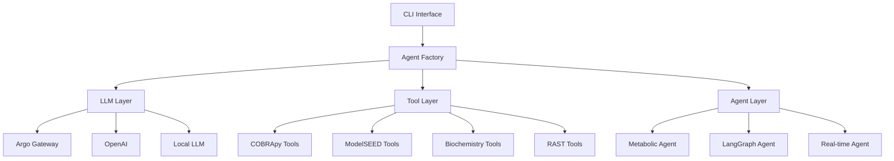

# API Documentation Overview

ModelSEEDagent provides a comprehensive Python API for AI-powered metabolic modeling. The API is organized into several key components that work together to provide sophisticated metabolic analysis capabilities.

## Architecture Overview



## Core Components

### Agents (`src.agents`)

The agent system provides AI-powered workflow orchestration:

- **Base Agent** - Foundation for all agent implementations
- **Metabolic Agent** - Specialized for metabolic modeling workflows
- **LangGraph Agent** - Graph-based workflow execution with visualization
- **Real-time Agent** - Dynamic decision-making with continuous learning

### Tools (`src.tools`)

Comprehensive toolset for metabolic analysis:

- **COBRApy Tools** (12 tools) - Complete COBRApy ecosystem integration
- **ModelSEED Tools** (5 tools) - Genome annotation and model building
- **Biochemistry Tools** (2 tools) - Universal ID resolution and search
- **AI Media Tools** (6 tools) - Intelligent media management and optimization

### LLM Integration (`src.llm`)

Multi-LLM backend support:

- **Factory Pattern** - Unified LLM interface
- **Argo Gateway** - Enterprise-grade model access (Production Ready)
- **OpenAI** - GPT-4 and other OpenAI models (Experimental)
- **Local LLM** - Support for local Llama models

### CLI Interface (`src.cli`)

Professional command-line interface:

- **Main CLI** - Primary interface with rich formatting
- **Interactive Mode** - Conversational analysis interface
- **Audit Viewer** - Analysis result visualization
- **Debug Tools** - System status and diagnostics

### Configuration (`src.config`)

Flexible configuration system:

- **Settings Management** - Environment-based configuration
- **Debug Configuration** - Granular logging control
- **Prompt Templates** - Customizable AI prompts

## Key Features

### Production Ready

- **27 Total Tools** - Complete metabolic modeling toolkit
- **Multi-LLM Support** - Choose your preferred language model
- **Professional CLI** - Rich, interactive command-line interface
- **Comprehensive Audit** - Full execution tracking and verification

### Scientific Accuracy

- **Universal Compatibility** - Perfect ModelSEED ↔ COBRApy integration
- **Biochemistry Database** - 500K+ entity mappings with real-time resolution
- **Precision Configuration** - Adjustable tolerance levels for numerical methods
- **Advanced Verification** - Hallucination detection and result validation

### High Performance

- **Intelligent Caching** - Significant speedup for repeated operations
- **Parallel Execution** - Multi-threaded tool execution
- **Lazy Loading** - Efficient resource utilization
- **Agent Pooling** - Reusable agent instances

## Usage Patterns

### Programmatic Access

#### Basic Agent Usage with Argo Gateway (Recommended)

```python
from src.agents.langgraph_metabolic import LangGraphMetabolicAgent
from src.llm.argo import ArgoLLM
from src.tools.cobra.fba import FBATool

# Configure LLM
llm_config = {
    "model_name": "gpt4o",
    "system_content": "You are an expert metabolic modeling assistant.",
    "max_tokens": 1000,
    "temperature": 0.1,
}

# Initialize components
llm = ArgoLLM(llm_config)
tools = [FBATool({"name": "run_fba", "description": "Run FBA analysis"})]
agent = LangGraphMetabolicAgent(llm, tools, {"name": "metabolic_agent"})

# Run analysis
result = agent.run({
    "query": "Analyze the metabolic model structure",
    "model_path": "path/to/model.xml"
})
print(result.message)
```

#### Basic Agent Usage with OpenAI (Experimental)

```python
from src.agents.langgraph_metabolic import LangGraphMetabolicAgent
from src.llm.openai_llm import OpenAILLM
from src.tools.cobra.fba import FBATool

# Configure LLM
llm_config = {
    "model_name": "gpt-4",
    "system_content": "You are an expert metabolic modeling assistant.",
    "max_tokens": 1000,
    "temperature": 0.1
}

# Initialize components
llm = OpenAILLM(llm_config)
tools = [FBATool({"name": "run_fba", "description": "Run FBA analysis"})]
agent = LangGraphMetabolicAgent(llm, tools, {"name": "metabolic_agent"})

# Run analysis
result = agent.run({
    "query": "Analyze the growth rate of this E. coli model",
    "model_path": "data/examples/e_coli_core.xml"
})
```

#### Direct Tool Usage

```python
from src.tools.cobra.fba import FBATool
from src.tools.biochem.resolver import BiochemResolver

# Initialize tools
fba_tool = FBATool()
biochem_tool = BiochemResolver()

# Run FBA analysis
fba_result = fba_tool.execute({
    "model_file": "path/to/model.xml",
    "media": "glucose_minimal",
    "objective": "BIOMASS_Ecoli_core_w_GAM"
})

# Resolve compound information
compound_info = biochem_tool.execute({
    "query": "cpd00027",
    "search_type": "id"
})
```

### CLI Usage

```bash
# Interactive analysis session
modelseed-agent interactive

# Direct model analysis
modelseed-agent analyze path/to/model.xml --query "Find essential genes"

# Configure system
modelseed-agent setup --backend argo

# View system status
modelseed-agent status

# Debug configuration
modelseed-agent debug

# View audit logs
modelseed-agent audit list
```

## Advanced Examples

### Complete Workflow Example

```python
import asyncio
from src.agents.langgraph_metabolic import LangGraphMetabolicAgent
from src.llm.openai_llm import OpenAILLM
from src.tools.cobra.fba import FBATool
from src.tools.cobra.essentiality import EssentialityTool
from src.tools.cobra.flux_variability import FluxVariabilityTool

async def comprehensive_analysis():
    # Setup
    llm = OpenAILLM({
        "model_name": "gpt-4",
        "system_content": "Expert metabolic modeling assistant",
        "temperature": 0.1
    })

    tools = [
        FBATool(),
        EssentialityTool(),
        FluxVariabilityTool()
    ]

    agent = LangGraphMetabolicAgent(llm, tools, {"name": "comprehensive_agent"})

    # Sequential analysis
    analyses = [
        "Load and validate the E. coli core model",
        "Run flux balance analysis with glucose minimal media",
        "Identify essential genes and reactions",
        "Perform flux variability analysis for central metabolism",
        "Summarize findings and generate recommendations"
    ]

    results = []
    for query in analyses:
        result = await agent.run({
            "query": query,
            "model_path": "data/examples/e_coli_core.xml"
        })
        results.append(result)
        print(f"Completed: {query}")

    return results

# Run the analysis
results = asyncio.run(comprehensive_analysis())
```

### Custom Tool Integration

```python
from src.tools.base import BaseTool
from pydantic import BaseModel

class CustomAnalysisTool(BaseTool):
    """Custom tool for specialized analysis"""

    class Input(BaseModel):
        model_file: str
        analysis_type: str
        parameters: dict = {}

    class Output(BaseModel):
        results: dict
        summary: str

    def _execute(self, inputs: Input) -> Output:
        # Your custom analysis logic here
        results = self.custom_analysis(inputs.model_file, inputs.analysis_type)

        return self.Output(
            results=results,
            summary=f"Custom analysis completed for {inputs.model_file}"
        )

    def custom_analysis(self, model_file: str, analysis_type: str) -> dict:
        # Implement your analysis
        return {"custom_metric": 42}

# Register and use the custom tool
custom_tool = CustomAnalysisTool()
agent = LangGraphMetabolicAgent(llm, [custom_tool], {"name": "custom_agent"})
```

## Error Handling

The API includes comprehensive error handling:

- **Tool Validation** - Input validation and type checking
- **LLM Fallbacks** - Automatic retry with different models
- **Graceful Degradation** - Fallback to basic functionality when needed
- **Detailed Logging** - Comprehensive error reporting and debugging

```python
try:
    result = agent.run({"query": "Analyze model", "model_path": "invalid.xml"})
except ValidationError as e:
    print(f"Input validation failed: {e}")
except ModelLoadError as e:
    print(f"Model loading failed: {e}")
except LLMError as e:
    print(f"LLM communication failed: {e}")
```

## Extension Points

The API is designed for extensibility:

- **Custom Tools** - Add new analysis capabilities
- **Custom Agents** - Implement specialized workflows
- **Custom LLMs** - Integrate additional language models
- **Custom Workflows** - Create domain-specific analysis pipelines

## Tool Implementation Details

For detailed technical implementation information including parameters, precision configurations, and advanced usage patterns, see the comprehensive [Tool Implementation Reference](tools.md).

## Documentation Links

- **[Getting Started](../getting-started/quickstart-cli.md)** - Installation and basic usage
- **[Interactive Guide](../getting-started/interactive-guide.md)** - Natural-language interface
- **[Architecture](../ARCHITECTURE.md)** - System design and components
- **[Tool Reference](../TOOL_REFERENCE.md)** - User-friendly tool descriptions
- **[Tool Implementation Reference](tools.md)** - Technical implementation details
- **[Debug Configuration](../debug.md)** - Troubleshooting and debugging
- **[Troubleshooting](../troubleshooting.md)** - Common issues and solutions
