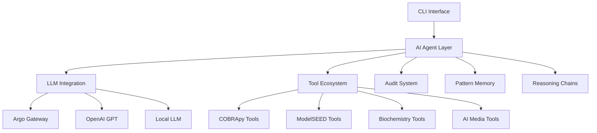

# ModelSEEDagent

**Advanced AI-Powered Metabolic Modeling Platform**

ModelSEEDagent is a production-ready AI-powered metabolic modeling platform that combines large language models with **29 specialized bioinformatics tools** and **advanced AI reasoning capabilities**. Built on LangGraph for intelligent workflow orchestration, it provides comprehensive metabolic modeling AI assistance for research and analysis.

## Quick Start

```bash
# Install ModelSEEDagent (development setup)
git clone https://github.com/ModelSEED/ModelSEEDagent.git
cd ModelSEEDagent
pip install -e .[all]

# Basic metabolic model analysis
modelseed-agent analyze data/examples/e_coli_core.xml --query "Find essential genes"

# Interactive natural language interface
modelseed-agent interactive

# Configure LLM backend
modelseed-agent setup
```

## Core Capabilities

- **Complete Genome-to-Model Pipeline** - RAST annotation → Model building → Gapfilling
- **Advanced COBRA Analysis** - 16 tools covering comprehensive COBRApy capabilities
- **Universal Model Compatibility** - Seamless ModelSEED ↔ COBRApy integration
- **Biochemistry Intelligence** - Universal ID resolution across 45K+ compounds and 55K+ reactions
- **Advanced AI Reasoning** - Multi-step analysis chains, hypothesis testing, collaborative decisions
- **Pattern Learning** - Cross-model learning and intelligent recommendations
- **AI Transparency** - Comprehensive hallucination detection and audit system
- **Natural Language Interface** - Conversational AI for complex metabolic analysis
- **Intelligent Media Management** - 6 specialized tools for media optimization and analysis

## Advanced AI Features

ModelSEEDagent includes cutting-edge AI capabilities for sophisticated metabolic analysis:

### Multi-Step Reasoning
AI plans and executes complex 5-10 step analysis sequences, adapting in real-time:
```bash
modelseed-agent analyze model.xml --query "Perform multi-step analysis"
```

### Hypothesis-Driven Analysis
Scientific hypothesis generation and systematic testing:
```bash
modelseed-agent analyze model.xml --query "Generate and test hypotheses"
```

### Collaborative AI Decision Making
Multiple AI agents collaborate on complex analysis decisions:
```bash
modelseed-agent analyze model.xml --query "Use collaborative reasoning"
```

### Cross-Model Pattern Learning
AI learns from analysis patterns across different models:
```bash
modelseed-agent analyze model.xml --query "Learn from analysis patterns"
```

## Complete Tool Suite (29 Tools)

### ModelSEED Tools (5 tools)
- **Genome Annotation** - RAST-based automated annotation
- **Model Building** - MSBuilder with template-based reconstruction
- **Gapfilling** - Advanced pathway completion algorithms
- **Protein Annotation** - Sequence-based functional annotation
- **Model Compatibility** - ModelSEED ↔ COBRApy compatibility testing

### COBRApy Tools (16 tools)
- **FBA & pFBA** - Flux balance analysis with parsimonious variants
- **Flux Variability Analysis** - Solution space exploration
- **Gene Deletion Analysis** - In-silico knockout studies
- **Essentiality Analysis** - Essential gene identification
- **Flux Sampling** - Unbiased solution space sampling
- **Production Envelope** - Phenotype phase plane analysis
- **Reaction Expression** - Gene expression integration
- **Model Analysis** - Comprehensive model statistics
- **Pathway Analysis** - Metabolic pathway insights
- **Auxotrophy Identification** - Growth requirement analysis
- **Minimal Media Finding** - Essential media component identification
- **Missing Media Detection** - Media gap identification
- **Media Selector** - AI-powered optimal media selection
- **Media Manipulator** - Natural language media modification
- **Media Compatibility** - Cross-model media validation
- **Media Comparator** - Comprehensive media performance analysis

### Biochemistry Tools (2 tools)
- **Universal ID Resolution** - Cross-database compound/reaction mapping
- **Biochemistry Search** - Intelligent metabolite discovery

### RAST Tools (2 tools)
- **RAST Annotation** - Automated genome annotation via RAST
- **Annotation Analysis** - Comprehensive annotation quality assessment

### Advanced AI Media Tools (6 tools)
- **Media Optimization** - AI-driven media composition optimization
- **Auxotrophy Prediction** - AI-powered auxotrophy prediction and validation
- **Media Selector** - Intelligent media recommendation based on model characteristics
- **Media Manipulator** - Natural language media modification and testing
- **Media Compatibility** - Cross-model media validation and analysis
- **Media Comparator** - Comprehensive media performance comparison

## System Architecture



For detailed architecture information, see the [Architecture Guide](ARCHITECTURE.md).

## Getting Started

### 1. Installation
See the [Installation Guide](installation.md) for detailed setup instructions.

### 2. User Guide
Check out the [Getting Started Guide](user/README.md) and [Interactive Guide](user/INTERACTIVE_GUIDE.md) for comprehensive usage instructions.

### 3. API Documentation
Explore the [API Documentation](api/overview.md) for programmatic usage.

### 4. Troubleshooting
Visit the [Troubleshooting Guide](troubleshooting.md) for common issues and solutions.

## Development & Contributing

- [Contributing Guide](development/CONTRIBUTING.md)
- [Architecture Documentation](ARCHITECTURE.md)
- [Debug Configuration](debug.md)

## Production Deployment

- [Deployment Guide](deployment.md)
- [Configuration Reference](configuration.md)
- [Monitoring Setup](monitoring.md)

## Project Status

ModelSEEDagent is **production-ready** and actively maintained. See [Project Status](PROJECT_STATUS.md) for detailed information.

## Support

- **Documentation**: Comprehensive guides and API reference
- **Examples**: Working code examples and tutorials
- **Issues**: GitHub issue tracker for bug reports and feature requests
- **Community**: Discussions and Q&A forum

---

**Ready to start metabolic modeling with AI?** Begin with the [Installation Guide](installation.md).
