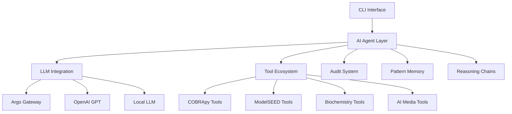

# ModelSEEDagent

**Advanced AI-Powered Metabolic Modeling Platform**

ModelSEEDagent is an **LLM-powered metabolic-modeling toolkit** that currently ships with **28 production-grade analysis tools**.  The **interactive interface is stable** and the **CLI is production-ready** with comprehensive command support.

## What's New (2025-06-17)

**Latest Updates:**
- **Perfect Testing**: 92/92 validation tests passing (100% success rate)
- **Enhanced CLI**: Complete command reference with examples and troubleshooting
- **Performance Optimizations**: Connection pooling, model caching, biological validation
- **Tool Status**: 30 tools validated across 4 model formats (BiGG + ModelSEED)

## Quick Start

For installation instructions, see the [Installation Guide](getting-started/installation.md).

```bash
# Basic metabolic model analysis
modelseed-agent analyze data/examples/e_coli_core.xml --query "Find essential genes"

# Interactive natural language interface
modelseed-agent interactive

# Configure LLM backend (Argo Gateway recommended)
modelseed-agent setup --backend argo
```

## Core Capabilities

- **Complete Genome-to-Model Pipeline** - RAST annotation → Model building → Gapfilling
- **Advanced COBRA Analysis** - 12 tools covering comprehensive COBRApy capabilities
- **Universal Model Compatibility** - Seamless ModelSEED ↔ COBRApy integration
- **Biochemistry Intelligence** - Universal ID resolution across 45K+ compounds and 56K+ reactions
- **Advanced AI Reasoning** - Multi-step analysis chains, hypothesis testing (beta)
- **Pattern Learning** - In-session learning (cross-model learning planned)
- **AI Transparency** - Comprehensive hallucination detection and audit system
- **Natural Language Interface** - Conversational AI for complex metabolic analysis
- **Intelligent Media Management** - 6 specialized tools for media optimization and analysis

## Advanced AI Features

ModelSEEDagent includes cutting-edge AI capabilities for sophisticated metabolic analysis:

### Multi-Step Reasoning
AI plans and executes complex 5-10 step analysis sequences, adapting in real-time:
```bash
modelseed-agent analyze model.xml --query "Perform multi-step analysis"
```

### Hypothesis-Driven Analysis
Scientific hypothesis generation and systematic testing:
```bash
modelseed-agent analyze model.xml --query "Generate and test hypotheses"
```

### Collaborative AI Decision Making *(roadmap)*
Multiple AI agents collaborate on complex analysis decisions:
```bash
modelseed-agent analyze model.xml --query "Use collaborative reasoning"
```

### Cross-Model Pattern Learning *(roadmap)*
AI learns from analysis patterns across different models:
```bash
modelseed-agent analyze model.xml --query "Learn from analysis patterns"
```

## Complete Tool Suite (28 Tools)

### ModelSEED Tools (3 tools – service-dependent)
- **Genome Annotation** - RAST-based automated annotation
- **Model Building** - MSBuilder with template-based reconstruction
- **Gapfilling** - Advanced pathway completion algorithms
- **Protein Annotation (planned)** - Sequence-based functional annotation
- **Model Compatibility testing (planned)** - ModelSEED ↔ COBRApy compatibility testing

### COBRApy Tools (12 tools)
- **FBA & pFBA** - Flux balance analysis with parsimonious variants
- **Flux Variability Analysis** - Solution space exploration
- **Gene Deletion Analysis** - In-silico knockout studies
- **Essentiality Analysis** - Essential gene identification
- **Flux Sampling** - Unbiased solution space sampling
- **Production Envelope** - Phenotype phase plane analysis
- **Reaction Expression** - Gene expression integration
- **Model Analysis** - Comprehensive model statistics
- **Pathway Analysis** - Metabolic pathway insights
- **Auxotrophy Identification** - Growth requirement analysis
- **Minimal Media Finding** - Essential media component identification
- **Missing Media Detection** - Media gap identification

### Biochemistry Tools (2 tools)
- **Universal ID Resolution** - Cross-database compound/reaction mapping
- **Biochemistry Search** - Intelligent metabolite discovery

### RAST Tools (2 tools)
- **RAST Genome Annotation** - Automated genome annotation via RAST service
- **Annotation Quality Assessment** - Comprehensive annotation analysis and validation

### AI Media Tools (6 tools)
- **Media Optimization** - AI-driven media composition optimization
- **Auxotrophy Prediction** - AI-powered auxotrophy prediction and validation
- **Media Selector** - Intelligent media recommendation based on model characteristics
- **Media Manipulator** - Natural language media modification and testing
- **Media Compatibility** - Cross-model media validation and analysis
- **Media Comparator** - Comprehensive media performance comparison

## System Architecture



For detailed architecture information, see the [Architecture Guide](ARCHITECTURE.md).

## Getting Started

### 1. Installation
See the [Installation Guide](getting-started/installation.md) for detailed setup instructions.

### 2. User Guide
Check out the [Quick Start](getting-started/quickstart-cli.md) and [Interactive Guide](getting-started/interactive-guide.md) for comprehensive usage instructions.

### 3. API Documentation
Explore the [API Documentation](api/overview.md) for programmatic usage.

### 4. Troubleshooting
Visit the [Troubleshooting Guide](troubleshooting.md) for common issues and solutions.

## Development & Contributing

- [Development Roadmap](archive/development/DEVELOPMENT_ROADMAP.md)
- [Architecture Documentation](ARCHITECTURE.md)
- [Debug Configuration](debug.md)

## Project Status

ModelSEEDagent is **under active development** – the interactive interface is production-ready; the CLI and a few advanced features are marked experimental. For detailed project information, see the [Architecture Guide](ARCHITECTURE.md).

## Support

- **Documentation**: Comprehensive guides and API reference
- **Examples**: Working code examples and tutorials
- **Issues**: GitHub issue tracker for bug reports and feature requests
- **Community**: Discussions and Q&A forum

## Documentation

This comprehensive documentation was developed with the assistance of AI technology to ensure clarity, completeness, and technical accuracy. All content has been reviewed and validated by the ModelSEEDagent development team.

---

**Ready to start metabolic modeling with AI?** Begin with the [Installation Guide](getting-started/installation.md).
