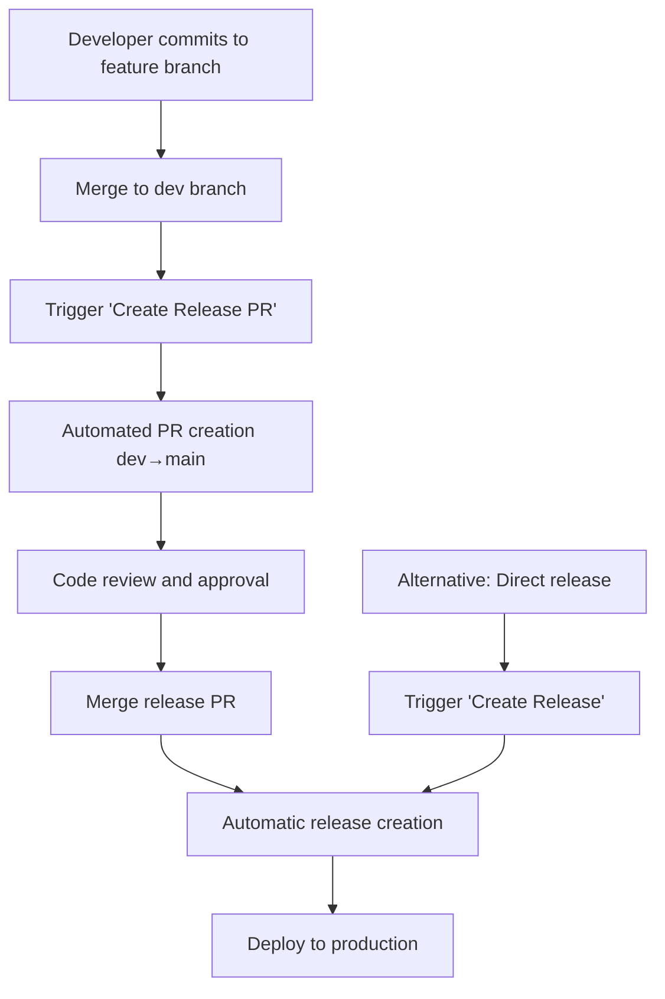

# Release Automation System

ModelSEEDagent features a comprehensive, AI-powered release automation system that provides intelligent version bumping, automated changelog generation, and complete release pipeline management.

## Overview

The release automation system consists of three integrated GitHub Actions workflows that work together to provide:

- **Intelligent Version Bumping** based on conventional commit analysis
- **Automated Changelog Generation** with categorized release notes
- **Comprehensive Validation Pipeline** with security scanning
- **Multiple Release Triggers** (manual, PR-based, scheduled)
- **Complete Release Documentation** with metrics and analytics

## System Architecture

```
┌─────────────────┐    ┌─────────────────┐    ┌─────────────────┐
│   Create        │    │   Create        │    │   Validate      │
│   Release       │    │   Release PR    │    │   Release       │
│                 │    │                 │    │                 │
│ • Version Bump  │    │ • PR Creation   │    │ • Code Quality  │
│ • Changelog     │    │ • Version Check │    │ • Security Scan │
│ • Git Tag       │    │ • Template Fill │    │ • Build Test    │
│ • GitHub Release│    │ • Auto-merge    │    │ • File Check    │
│ • PyPI Publish  │    │                 │    │                 │
└─────────────────┘    └─────────────────┘    └─────────────────┘
         │                       │                       │
         └───────────────────────┼───────────────────────┘
                                 │
                    ┌─────────────────┐
                    │   Intelligence  │
                    │   Engine        │
                    │                 │
                    │ • Commit Anal.  │
                    │ • Semver Logic  │
                    │ • Change Cat.   │
                    │ • Validation    │
                    └─────────────────┘
```

## Workflows

### 1. Create Release Workflow

**File**: `.github/workflows/release.yml`

**Purpose**: Main intelligent release automation with complete pipeline management.

**Triggers**:
- **Manual**: GitHub Actions → "Create Release" → Run workflow
- **Scheduled** (optional): Uncomment cron schedule for automated releases
- **Push-based** (optional): Uncomment push triggers for continuous releases

**Features**:
- Analyzes all commits since last release
- Determines version bump type automatically
- Generates categorized changelog
- Creates Git tags and GitHub releases
- Optional PyPI publishing
- Dry run capability for testing

**Input Parameters**:
```yaml
release_type:
  description: 'Release type'
  options: [auto, patch, minor, major]
  default: 'auto'

skip_pypi:
  description: 'Skip PyPI publishing'
  default: false

dry_run:
  description: 'Dry run (no actual release)'
  default: false
```

### 2. Create Release PR Workflow

**File**: `.github/workflows/create-release-pr.yml`

**Purpose**: Automated dev→main PR creation for release preparation.

**Triggers**:
- **Manual**: GitHub Actions → "Create Release PR" → Run workflow
- **Scheduled** (optional): Configure for regular release cycles

**Features**:
- Analyzes changes between dev and main branches
- Creates structured release PR with changelog
- Pre-fills release templates
- Validates version consistency
- Auto-assigns reviewers

**Workflow**:
1. Analyzes commits on dev branch
2. Determines appropriate version bump
3. Updates version in pyproject.toml
4. Generates release changelog
5. Creates PR with structured template
6. Triggers validation workflows

### 3. Validate Release Workflow

**File**: `.github/workflows/validate-release.yml`

**Purpose**: Comprehensive pre-release validation and quality assurance.

**Triggers**:
- **Pull Request**: Automatically on PRs to main branch
- **Workflow Call**: Called by other workflows for validation

**Validation Checks**:

#### Version Validation
- Validates `pyproject.toml` structure
- Checks semantic versioning format (X.Y.Z)
- Verifies changelog entries
- Confirms required files presence

#### Code Quality
- Runs pytest test suite
- Performs black code formatting check
- Validates isort import sorting
- Builds package artifacts
- Tests package installation

#### Security
- Scans dependencies for vulnerabilities
- Checks for exposed secrets
- Validates secure configurations

#### Release Notes
- Validates PR description format
- Ensures required sections present
- Checks release documentation

## Intelligent Version Bumping

The system uses conventional commit analysis to determine appropriate version bumps:

### Commit Analysis Rules

```python
# Major Version (X.0.0) - Breaking Changes
"BREAKING CHANGE:" or "!:" in commit message
→ Increments major version, resets minor/patch to 0

# Minor Version (X.Y.0) - New Features
"feat:" prefix in commit message
→ Increments minor version, resets patch to 0

# Patch Version (X.Y.Z) - Bug Fixes
"fix:" prefix in commit message
→ Increments patch version

# Default Behavior
Any other changes → Patch increment
```

### Example Version Progression

```bash
# Current version: 1.2.3

# Commits since last release:
- "feat: Add new AI media optimization tool"
- "fix: Resolve model loading timeout issue"
- "docs: Update installation guide"

# Analysis Result:
- Features detected: 1 → Minor bump
- Bug fixes detected: 1
- Documentation: 1

# New version: 1.3.0 (minor bump takes precedence)
```

## Automated Changelog Generation

The system generates intelligent, categorized changelogs automatically:

### Changelog Categories

```markdown
## What's Changed

### Breaking Changes
- BREAKING CHANGE: API endpoint restructure
- feat!: Remove deprecated legacy tools

### New Features
- feat: Add intelligent media optimization
- feat: Implement real-time model analysis

### Bug Fixes
- fix: Resolve memory leak in FBA calculations
- fix: Handle malformed SBML files gracefully

### Documentation
- docs: Add comprehensive API examples
- docs: Update installation requirements

### Other Changes
- chore: Update dependency versions
- refactor: Improve error handling
```

### Changelog Enhancement

The system automatically:
- **Cleans commit messages** (removes prefixes like "feat:", "fix:")
- **Groups related changes** by category and importance
- **Adds context links** to full changelog comparisons
- **Includes metrics** (feature count, fix count, etc.)
- **Generates URLs** for complete change comparison

## Usage Guide

### Option 1: Manual Release (Recommended)

**Step 1**: Navigate to GitHub Actions
```
Repository → Actions → "Create Release" → "Run workflow"
```

**Step 2**: Configure Release
```yaml
Branch: main (or dev for pre-release)
Release type: auto (recommended)
Skip PyPI: false (publish to PyPI)
Dry run: false (create actual release)
```

**Step 3**: Monitor Execution
- Watch the workflow progress in real-time
- Review generated changelog and version bump
- Verify all validation checks pass

**Step 4**: Verify Release
```bash
# Check the created release
gh release view v1.3.0

# Verify PyPI publication
pip install modelseed-agent==1.3.0
```

### Option 2: PR-Based Release

**Step 1**: Create Release PR
```
Actions → "Create Release PR" → "Run workflow"
```

**Step 2**: Review Generated PR
- Examine the automated changelog
- Verify version bump logic
- Review all changed files
- Test in development environment

**Step 3**: Merge Release PR
```bash
# The PR will trigger validation automatically
# Once approved and merged, release is created automatically
```

### Option 3: Scheduled Releases (Optional)

Enable automatic releases by uncommenting the schedule trigger:

```yaml
# In .github/workflows/release.yml
schedule:
  - cron: '0 0 * * 1'  # Every Monday at midnight
```

## Testing and Validation

### Dry Run Testing

Always test releases with dry run first:

```yaml
# Run workflow with these settings:
Release type: auto
Skip PyPI: true
Dry run: true
```

**Dry Run Results**:
- Analyzes commits and determines version bump
- Generates complete changelog
- Shows all changes that would be made
- **Does not create**: Git tags, GitHub releases, or PyPI uploads

### Pre-Release Testing

For testing on dev branch:

```bash
# Create pre-release from dev branch
gh workflow run release.yml \
  --ref dev \
  --field release_type=auto \
  --field skip_pypi=true \
  --field dry_run=false
```

### Validation Pipeline Testing

Test individual validation components:

```bash
# Test version validation
poetry check
poetry version --short

# Test code quality
black --check src/
isort --check-only src/
pytest tests/

# Test security
safety check -r requirements.txt

# Test package build
poetry build
```

## Configuration Options

### Version Bump Configuration

Customize version bump logic in `.github/workflows/release.yml`:

```yaml
# Force specific version type
release_type: 'minor'  # Options: auto, patch, minor, major

# Customize commit analysis
breaking_changes_pattern: 'BREAKING CHANGE|!:'
feature_pattern: '^feat'
fix_pattern: '^fix'
```

### PyPI Publishing Configuration

Configure PyPI publishing in repository secrets:

```bash
# Required secret
PYPI_API_TOKEN=pypi-your-token-here

# Optional: Test PyPI
TEST_PYPI_API_TOKEN=testpypi-your-token-here
```

### Changelog Customization

Modify changelog generation in the release workflow:

```yaml
# Changelog sections
sections:
  - breaking: "Breaking Changes"
  - features: "New Features"
  - fixes: "Bug Fixes"
  - docs: "Documentation"
  - other: "Other Changes"
```

## Integration with Development Workflow

### Conventional Commits

The system works best with conventional commit messages:

```bash
# Feature commits
git commit -m "feat: add intelligent media optimization system"

# Bug fix commits
git commit -m "fix: resolve timeout in model loading process"

# Breaking change commits
git commit -m "feat!: restructure API endpoints for v2.0"
git commit -m "feat: major API changes

BREAKING CHANGE: The analyze() function signature has changed.
Migrate from analyze(model, media) to analyze(options={model, media})"

# Documentation commits
git commit -m "docs: add comprehensive deployment guide"

# Maintenance commits
git commit -m "chore: update dependencies to latest versions"
```

### Branch Strategy

Recommended git flow for release automation:

```
main branch (production)
├── Latest stable releases
├── Protected branch requiring PR reviews
└── Triggers production deployments

dev branch (development)
├── Active development work
├── Feature integration testing
├── Pre-release validation
└── Source for release PRs

feature branches
├── Individual feature development
├── Merge to dev when complete
└── Follow conventional commit format
```

### Release Workflow Integration



## Monitoring and Analytics

### Release Metrics

The system automatically tracks:

```yaml
Release Analytics:
  - Version bump rationale and analysis
  - Commit categorization statistics
  - Breaking changes and impact assessment
  - Feature and fix counts per release
  - Release frequency and velocity metrics
  - Validation success/failure rates
```

### Release Summary Output

Each release generates a comprehensive summary:

```markdown
## Release Summary

- **Version**: 1.2.3 → 1.3.0
- **Bump Type**: minor
- **Breaking Changes**: 0
- **Features**: 3
- **Bug Fixes**: 2
- **Total Commits**: 12
- **Validation**: All checks passed
- **PyPI**: Published successfully

### Generated Changelog
[Complete categorized changelog with links]

### Quality Metrics
- Test Coverage: 94%
- Security Score: A+
- Build Time: 2m 34s
```

## Troubleshooting

### Common Issues

#### Version Bump Not Working

```bash
# Check commit message format
git log --oneline -10

# Verify conventional commit format
# Good: "feat: add new feature"
# Bad: "adding new feature"

# Fix: Use conventional commits consistently
```

#### Validation Failures

```bash
# Check validation logs
gh run list --workflow="validate-release"
gh run view <run-id> --log-failed

# Common fixes:
- Ensure LICENSE file exists
- Fix pyproject.toml syntax errors
- Resolve test failures
- Address security vulnerabilities
```

#### PyPI Publishing Errors

```bash
# Verify PyPI token
gh secret list | grep PYPI

# Check package build
poetry build
poetry publish --dry-run

# Common issues:
- Invalid API token
- Version already exists on PyPI
- Package build failures
```

#### Changelog Generation Issues

```bash
# Check commit history
git log --oneline main..dev

# Verify conventional commit format
# Missing commits: Check branch protection rules
# Empty changelog: Ensure commits follow conventional format
```

### Debug Mode

Enable debug output in workflows:

```yaml
# Add to workflow steps
- name: Debug Analysis
  run: |
    echo "Debug Mode Enabled"
    set -x  # Enable command tracing
    # ... existing commands
```

### Manual Intervention

If automation fails, create releases manually:

```bash
# Manual version update
poetry version minor  # or patch/major

# Manual changelog update
# Edit CHANGELOG.md manually

# Manual git operations
git add pyproject.toml CHANGELOG.md
git commit -m "chore: prepare release v1.3.0"
git tag -a v1.3.0 -m "Release v1.3.0"
git push origin main --tags

# Manual GitHub release
gh release create v1.3.0 \
  --title "Release v1.3.0" \
  --notes-file CHANGELOG.md \
  --latest
```

## Security Considerations

### Secrets Management

```yaml
Required Secrets:
  GITHUB_TOKEN: # Automatically provided
  PYPI_API_TOKEN: # Required for PyPI publishing

Optional Secrets:
  TEST_PYPI_API_TOKEN: # For test publishing
  SLACK_WEBHOOK: # For release notifications
```

### Permission Requirements

```yaml
Workflow Permissions:
  contents: write    # For creating releases and tags
  pull-requests: write  # For PR creation and updates
  packages: write    # For package publishing
  checks: write      # For validation status
```

### Security Scanning

The validation workflow includes:
- **Dependency vulnerability scanning** with Safety
- **Secret detection** in code and configs
- **License compatibility checking**
- **Code quality security rules**

## Best Practices

### Commit Message Guidelines

```bash
# Use conventional commit format consistently
feat: add new functionality
fix: resolve specific bug
docs: update documentation
chore: maintenance tasks
refactor: code improvements without feature changes
test: add or update tests

# Include detailed descriptions for breaking changes
feat!: restructure API

BREAKING CHANGE: The analyze() method signature has changed.
Previous: analyze(model, media)
New: analyze({model: model, media: media, options: {}})

Migration guide: ...
```

### Release Planning

```bash
# Plan releases around feature completions
# Group related features in single release
# Communicate breaking changes in advance
# Test pre-releases thoroughly

# Example release cycle:
# Sprint 1-2: Feature development (dev branch)
# Sprint 3: Integration testing (dev branch)
# Sprint 4: Release preparation (create release PR)
# Release: Deploy to production (merge to main)
```

### Quality Gates

```yaml
Pre-Release Checklist:
  - All tests passing
  - Security scan clean
  - Documentation updated
  - Breaking changes documented
  - Migration guides provided
  - Performance impact assessed
  - Backwards compatibility verified
```

## Advanced Configuration

### Custom Release Templates

Create custom release note templates in `.github/RELEASE_NOTES_TEMPLATE.md`:

```markdown
## ModelSEEDagent v{{version}}

### Highlights
{{highlights}}

### Changes
{{changelog}}

### Upgrade Instructions
{{upgrade_instructions}}

### Metrics
- **New Tools**: {{tool_count}}
- **Performance**: {{performance_improvements}}
- **Compatibility**: {{compatibility_info}}
```

### Notification Integration

Add Slack notifications to release workflow:

```yaml
- name: Notify Release
  if: success()
  run: |
    curl -X POST -H 'Content-type: application/json' \
      --data '{"text":"Released ModelSEEDagent v${{ needs.analyze-changes.outputs.new_version }}"}' \
      ${{ secrets.SLACK_WEBHOOK }}
```

### Multi-Environment Releases

Configure different release targets:

```yaml
# Production release
- name: Deploy to Production
  if: github.ref == 'refs/heads/main'
  run: deploy-production.sh

# Staging release
- name: Deploy to Staging
  if: github.ref == 'refs/heads/dev'
  run: deploy-staging.sh
```

The ModelSEEDagent release automation system provides enterprise-grade release management with minimal manual intervention, ensuring consistent, high-quality releases while maintaining full transparency and control over the release process.
